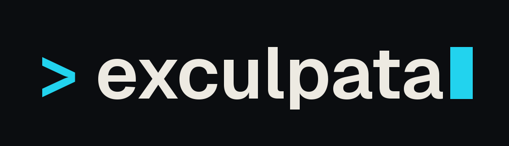
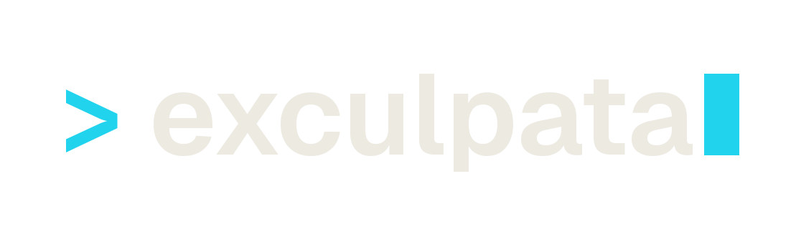
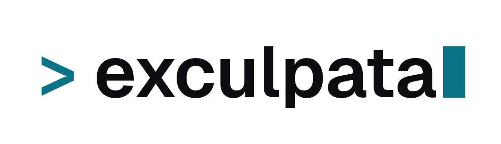
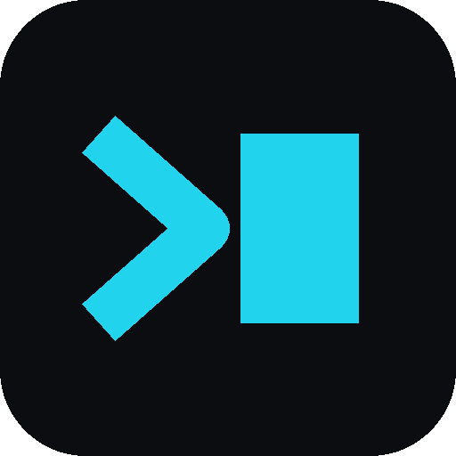
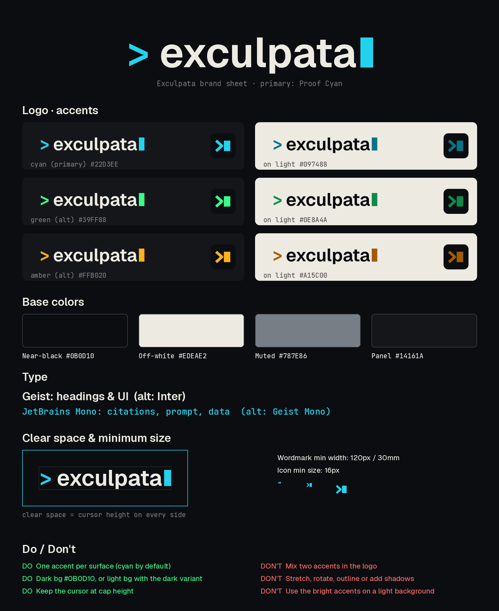

# Exculpata brand

## Logo

- Wordmark: `> exculpata█`. The prompt is JetBrains Mono Bold and the name is Geist (weight 620). The cursor block is cap height and sits on the baseline.
- Icon / favicon: `>█` on a #0B0D10 rounded square.

| Asset | Path |
| --- | --- |
| Wordmark, cyan on near-black | [wordmark-cyan-dark.png](assets/brand/wordmark-cyan-dark.png) |
| Wordmark, transparent, light text | [wordmark-cyan-transparent-lighttext.png](assets/brand/wordmark-cyan-transparent-lighttext.png) |
| Wordmark, transparent, dark text | [wordmark-cyan-transparent-darktext.png](assets/brand/wordmark-cyan-transparent-darktext.png) |
| Wordmark SVG, dark background | [exculpata-wordmark.svg](assets/brand/exculpata-wordmark.svg) |
| Wordmark SVG, light background | [exculpata-wordmark-light.svg](assets/brand/exculpata-wordmark-light.svg) |
| Icon, cyan on near-black | [icon-cyan-512.png](assets/brand/icon-cyan-512.png) |
| Icon, transparent | [icon-cyan-transparent-512.png](assets/brand/icon-cyan-transparent-512.png) |
| Icon SVG, dark background | [exculpata-icon.svg](assets/brand/exculpata-icon.svg) |
| Icon SVG, light background | [exculpata-icon-light.svg](assets/brand/exculpata-icon-light.svg) |
| App icon, SVG | [favicon.svg](../src/case_intelligence/static/favicon.svg) |
| App icon, ICO | [favicon.ico](../src/case_intelligence/static/favicon.ico) |
| App icon, 16 | [favicon-16.png](../src/case_intelligence/static/favicon-16.png) |
| App icon, 32 | [favicon-32.png](../src/case_intelligence/static/favicon-32.png) |
| App icon, 180 apple touch | [apple-touch-icon.png](../src/case_intelligence/static/apple-touch-icon.png) |
| Brand sheet | [brand-sheet.png](assets/brand/brand-sheet.png) |
| Social preview, 1280×640 | [social-preview-1280x640.png](assets/brand/social-preview-1280x640.png) |
| Avatar, 400×400 | [x-avatar-cyan-400.png](assets/brand/x-avatar-cyan-400.png) |

The dark-background wordmark SVG uses Proof Cyan for the prompt and off-white for the name, on a transparent background. The light-background wordmark uses #097488 for the prompt and near-black for the name. The dark icon SVG matches the application favicon: a Proof Cyan chevron and block cursor on near-black. The light icon is the same chevron and cursor in #097488, with no plate.

## Color

| Role | Hex |
| --- | --- |
| **Primary accent: Proof Cyan** | **#22D3EE** |
| Primary accent on light bg | #097488 |
| Background (near-black) | #0B0D10 |
| Text / light bg (off-white) | #EDEAE2 |
| Alt accent: Terminal Green | #39FF88 (light bg #0E8A4A) |
| Alt accent: Signal Amber | #FFB020 (light bg #A15C00) |

Use one accent per surface, and cyan by default.

## Type (Google Fonts)

- Sans: Geist (alternative: Inter)
- Mono: JetBrains Mono (alternative: Geist Mono)

## Positioning

Exculpata is a discovery review workspace for criminal defense teams: drop in discovery and get cited answers. It is local-first by default.

- Tagline: "your discovery, cited."
- Repo: github.com/Exculpata/exculpata
