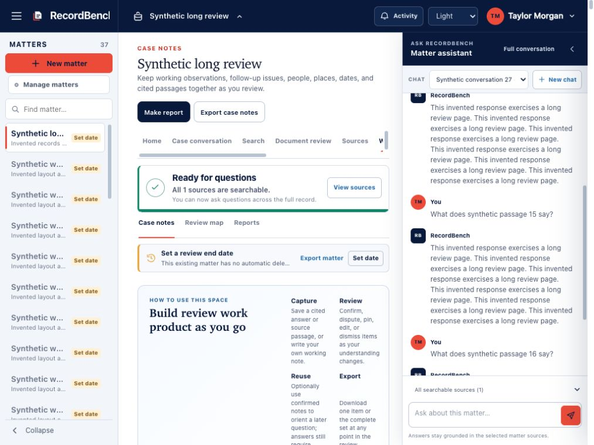
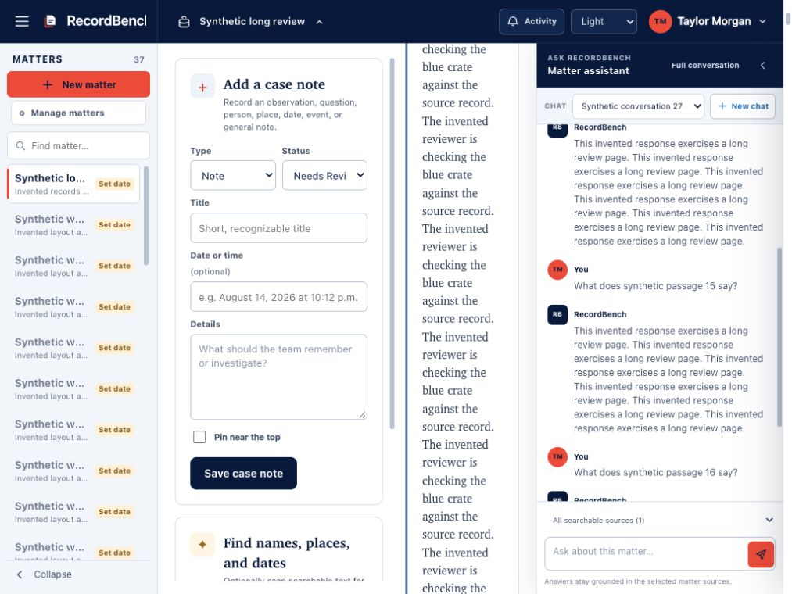
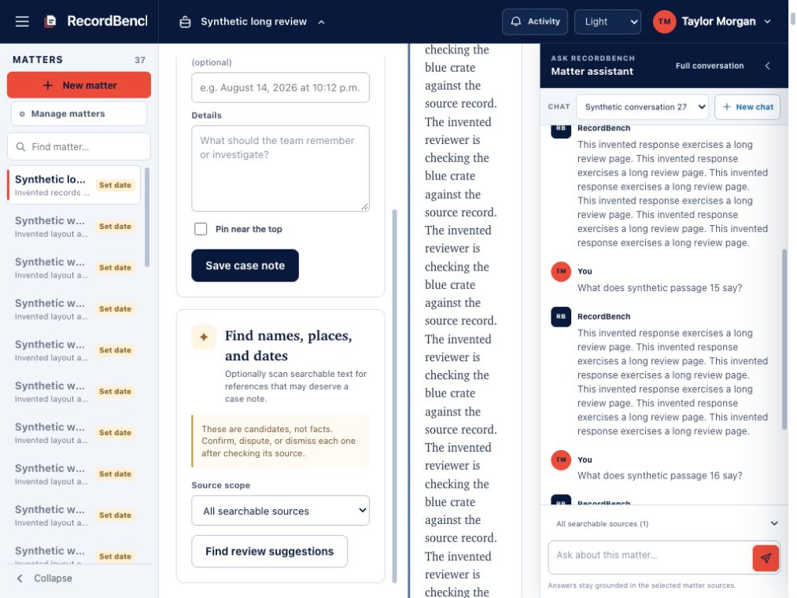
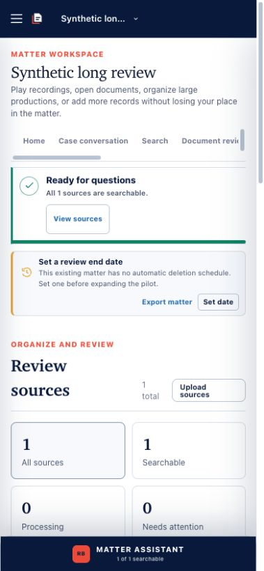
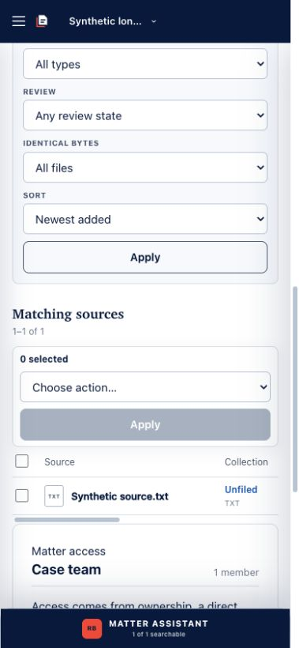
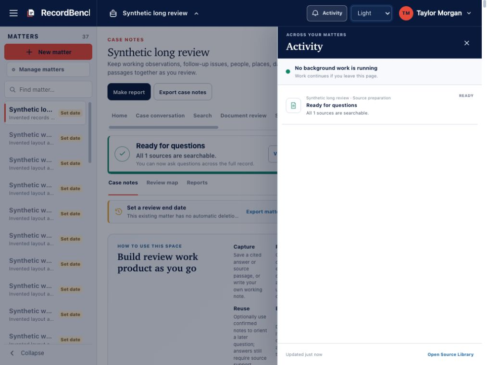
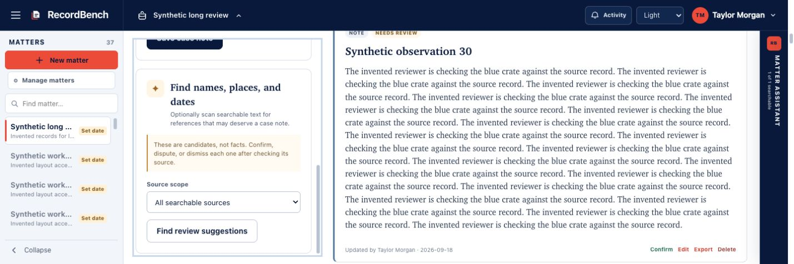
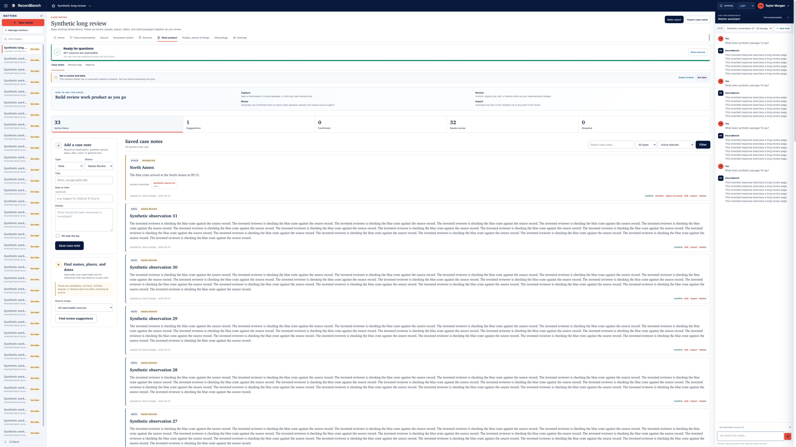

# UI usability audit: scaling, mobile, and wide desktops

Audit date: 2026-09-18 UTC. Source baseline:
`a49133f1fe022fb098f2519aea007fa562570371`. The checkout was clean when
the audit began. This document preserves the original observations before
implementation. See the [implementation handoff](UI_USABILITY_CLEANUP_PLAN.md)
and [subsequent repairs and validation](UI_USABILITY_CLEANUP_IMPLEMENTATION.md).

The product needs a bounded usability cleanup. The most consequential problems
are hidden mobile account controls, crowded desktop panels, navigation whose
current section is offscreen, and keyboard focus escaping a blocking drawer.
Wide desktops have the opposite problem: note text and actions stretch across
an unnecessarily large reading area.

The target is modern displays with different user preferences. A large physical
monitor does not imply abundant CSS layout space: OS scaling, browser zoom,
side panels, and font preferences all affect what fits. Conversely, users who
prefer small UI on a 4K display should get useful, balanced space. Enlarging
everything globally or squeezing everything into a narrow centered column would
miss this requirement.

## Evidence and scope

Current source was run in a disposable, loopback-only synthetic application.
The existing workspace-layout fixture supplied 37 invented matters, 32 long
notes, 28 conversations, and one text source. The generator was unavailable;
learned retrieval and background ingestion were disabled. One deterministic
suggestion action added the invented place “North Annex.” No installed node,
private records, credentials, model, or deployment configuration was used.

Accepted screenshots came from Chrome after incomplete in-app browser captures
were rejected. The measured CSS viewports were 1024×768, 390×844, 1440×480,
and 3840×2160. Screenshots were saved and visually inspected. Saved capture dimensions may differ from the measured CSS viewport; use the
recorded DOM measurements for layout dimensions.
Read-only DOM geometry and accessibility snapshots supplemented screenshots.
The [evidence manifest](ui-usability-audit/2026-09-18/evidence.json) records
measurements, screenshot hashes, and unrun checks.

These are viewport/reflow checks, not proof of actual OS scaling, browser zoom,
text-only enlargement, or a physical mobile device. An attempted browser zoom
shortcut did not change measured dimensions and is not counted as a zoom test.
Screen-reader output, touch, on-screen keyboards, WebKit, forced colors, and
complete theme contrast remain untested. Reports, media review, document-review
ledgers, administration, and recovery flows received source inspection only
where referenced below; they were not comprehensively walked in a browser.

## Captured walkthrough

### 1. Open Case notes with both desktop side panels — needs work

At 1024×768, the matter rail and Assistant leave too little room for the nested
note layout. Guidance, navigation, and status banners consume substantial space
before the working controls. The shared header and recognizable actions are
consistent, but the center has no effective minimum useful reading width.

### 2. Read notes and reach review suggestions — mixed

The saved-note column measured **147 CSS pixels**, with content extending to
210 pixels. Note prose wraps into a very tall strip. The status strip measured
443 pixels inside, with 554 pixels of content and hidden overflow. Lack of
page-level horizontal scrolling therefore does not establish usable content.

The left tools did scroll independently. Native scrolling revealed “Find review
suggestions”; activating it completed with “Added 1 new review suggestion(s)
from 1 source section(s).” The result retained its source link and Suggested
status. This is evidence that the existing scrolling repair works in this
tested state, not evidence that every scaling configuration is fixed.

### 3. Open Sources at mobile width — needs work

At 390×844, the section navigation had a 336-pixel visible area and 832 pixels
of link content. The selected Sources link started at x=375.6 and ended at
x=441.1, outside the navigation's visible area. Later destinations were also
offscreen. A horizontal scrollbar exists, but current location and the complete
set of destinations are not immediately apparent.

The header also hides its entire `.user-zone`: Activity, appearance, account
menu, and Sign out all measured zero-sized boxes. There is no alternate mobile
account menu in the shared base. This is lost functionality, not merely a
density preference.

### 4. Inspect mobile Sources filters and rows — usable with friction

Filter labels and controls stack legibly, and the selected count is explicit.
However, many screens of controls precede the rows. The source table retains
an 820-pixel minimum row width: identity is visible while review state and row
actions require sideways scrolling. This is contained table scrolling, not a
claim that the table alone fails WCAG reflow. It still makes ordinary phone
review cumbersome. The bulk action select has no associated accessible label.

### 5. Open Activity and navigate with the keyboard — needs work

At 1024×768, the scrim blocks the page visually, but initial focus remained on
the header's activity trigger. Pressing Tab moved focus to the underlying
Appearance select while Activity stayed open. Escape correctly closed the
drawer and restored focus to its trigger. The appearance and keyboard behavior
do not implement the same interaction contract.

### 6. Reach tools on a short desktop viewport — working in this state

At 1440×480 with the Assistant collapsed, End on the named Case note tools
region scrolled it to the bottom. Its scroll position was 528 pixels in a
392-pixel visible region; the recommendation button was visible at y=399–441.
Keep this behavior as a regression baseline. This is a height stress test,
not a recommendation to design around an old monitor size.

### 7. Open Case notes on a spacious 4K viewport — needs refinement

At 3840×2160 with both side panels open, the note library measured 2823 pixels.
Note prose measured **2781 pixels**, with 15-pixel text, 23.25-pixel line height,
and no maximum reading width. Card actions sit at the far opposite edge.
Everything fits, but the layout asks the eye and pointer to travel excessively.
Use bounded prose and related action groups within a spacious workspace;
preserve useful room for evidence and tools rather than stretching every row.

## Findings and implementation anchors

P1 means loss of access or substantial workflow interference. P2 means a
meaningful readability, consistency, or interaction improvement. These are
product priorities, not a formal conformance certification.

| ID | Priority | Finding | Evidence and source anchors |
| --- | --- | --- | --- |
| F01 | P1 | Mobile loses account, Activity and Sign out | Step 3 and computed `display:none`; `case-intelligence.css:4655–4691`, `workbench_base.html:40–80`. Later compact-header rules do not restore display. |
| F02 | P1 | Nested note columns ignore the width left by side panels | Steps 1–2; CSS `5796–5799`, `6107`, `6467–6468`; stats `5367–5375`. Two-column notes survive until the viewport reaches 760px even when its content area is already much smaller. |
| F03 | P1 | Mobile navigation starts with the active destination offscreen | Step 3; `workbench_matter_tabs.html:1–28`; CSS `1789–1802`, `5812–5822`. No selected-link reveal or explicit section chooser. |
| F04 | P1 | Activity focus remains outside the blocking drawer | Step 5; `case-intelligence.js:3009–3020`, `workbench_base.html:131–137`. Source additionally shows `replaceChildren` on refresh at JS `3053`; focus loss on a later refresh is a risk to reproduce. |
| F05 | P2 | Wide desktop prose and actions stretch too far apart | Step 7; `.notebook-body`, `.notebook-item`, `.notebook-item-actions`; shared full-width geometry is intentional in `workspace-layout.css:9–22`, so cap inner reading regions instead of undoing the shell. |
| F06 | P2 | Mobile Sources requires lateral scanning for ordinary row tasks | Step 4; `workbench_setup.html:273` onward; CSS `3867`, `5241`. Preserve selection, state, identity, and Open together in a narrow row/card presentation. |
| F07 | P2 | Bulk controls and secondary navigation have incomplete semantics | Step 4 shows an unnamed combobox; remaining conditional bulk fields are source-confirmed at `workbench_setup.html:258–269`. `workbench_work_product_tabs.html:1–5` lacks `aria-current`. |
| F08 | P2 | Keyboard focus and bypass patterns vary | Source-confirmed: global CSS `:focus-visible` removes outline at `92`; local Source Library and browser add their own outlines. No forced-colors fallback or shared skip-to-main link. Actual forced-colors and screen-reader consequences need testing. |
| F09 | P2 | Dusk ledger uses a potentially incompatible hardcoded surface | Source-only: pale Dusk `--ink` at CSS `5908–5910`, hardcoded pale ledger heading background at `8112`. Reproduce with a populated ledger and measure computed contrast before changing it. Existing Dusk Sources repair should be preserved. |
| F10 | P2 | Essential small copy and repeated guidance need a focused density pass | Steps 1, 3, 4, 7; essential status/help and navigation styles often use 9–11.5px. Small text is not automatically a WCAG failure. Prioritize readable status, nearby actions and progressive disclosure over universal enlargement. |

Paths above are under `src/case_intelligence/static/` or
`src/case_intelligence/templates/` as appropriate; line references identify
the recorded baseline and must be refreshed when implementing.

## Why existing checks missed these states

The standalone [workspace layout acceptance](../scripts/browser-accept-workspace-layout.py)
already tests native wheel and keyboard scrolling. Its `go()` helper always
collapses the Assistant, so its success cannot establish usable desktop notes
with that panel open. Its mobile checks establish alignment and scrolling, not
that users can find the active section or access account controls.

The [required browser runner](../scripts/run-browser-acceptance.py) currently
selects intake, Dusk, and reports; it does not run workspace layout. The layout
script's receipt also lacks the `passed` and `synthetic_only` fields the runner
requires. Integrate a small, representative usability journey after repairing
its receipt and environment isolation. Keep richer checks available locally.

CSS-string tests remain useful structural checks but cannot prove that a button
is visible, focused, unobscured, or usable. Likewise, `scrollWidth <= innerWidth`
does not detect a child whose content is hidden. Test real task completion,
hit targets, reading width, and current location as well as root overflow.

## Design and acceptance direction

Retain the established visual identity, semantic forms, source support, human
review statuses, and useful desktop tools. The cleanup needs shared layout and
interaction contracts, not a new frontend framework or new product workflow.

- Make layout depend on the space the working region actually has. Stack or
  rearrange tools before they squeeze content into unusable columns.
- Keep every case section and account action discoverable at narrow widths.
  Use ordinary labelled disclosures and links where possible.
- Bound prose to a comfortable measure, initially around 65–85 characters per
  line, while allowing tables, evidence and task tools to use wider regions.
  This is a design target, not a WCAG requirement.
- Keep touch actions comfortably sized; target 44 CSS pixels for primary mobile
  controls where practical. WCAG 2.2 AA's target-size criterion is 24×24 pixels
  with stated exceptions, not a blanket 44-pixel mandate.
- Establish visible focus, consistent labels and coherent drawer behavior.
  State and error feedback should remain attached to the relevant action.

Use WCAG 2.2 AA as the accessibility target for implementation, with separate
checks for [reflow](https://www.w3.org/WAI/WCAG22/Understanding/reflow.html),
[text resizing](https://www.w3.org/WAI/WCAG22/Understanding/resize-text.html),
[target size](https://www.w3.org/WAI/WCAG22/Understanding/target-size-minimum.html),
and [unobscured focus](https://www.w3.org/WAI/WCAG22/Understanding/focus-not-obscured-minimum.html).
These references guide acceptance; this bounded review is not a WCAG audit of
every route or an accessibility-compliance claim.

The implementation sequence, file ownership, regression fixtures, small-worker
prompts, and completion criteria are in the [cleanup plan](UI_USABILITY_CLEANUP_PLAN.md).
