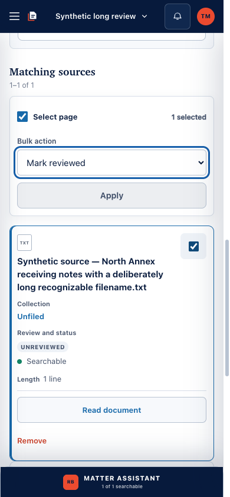
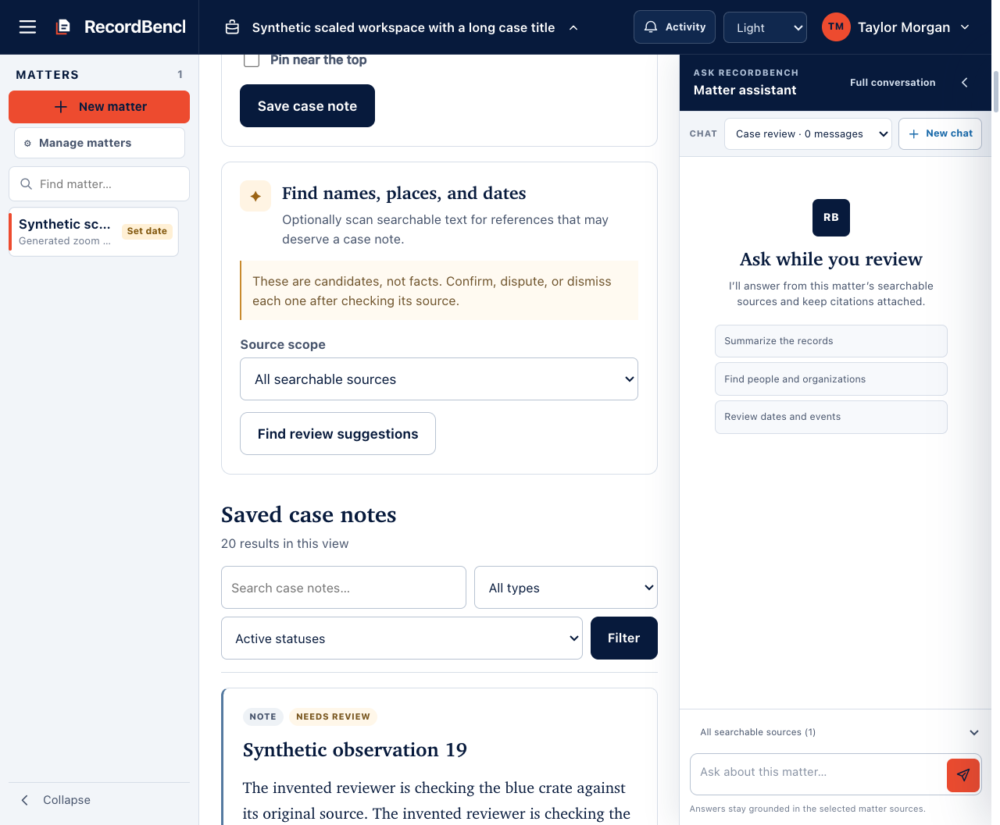
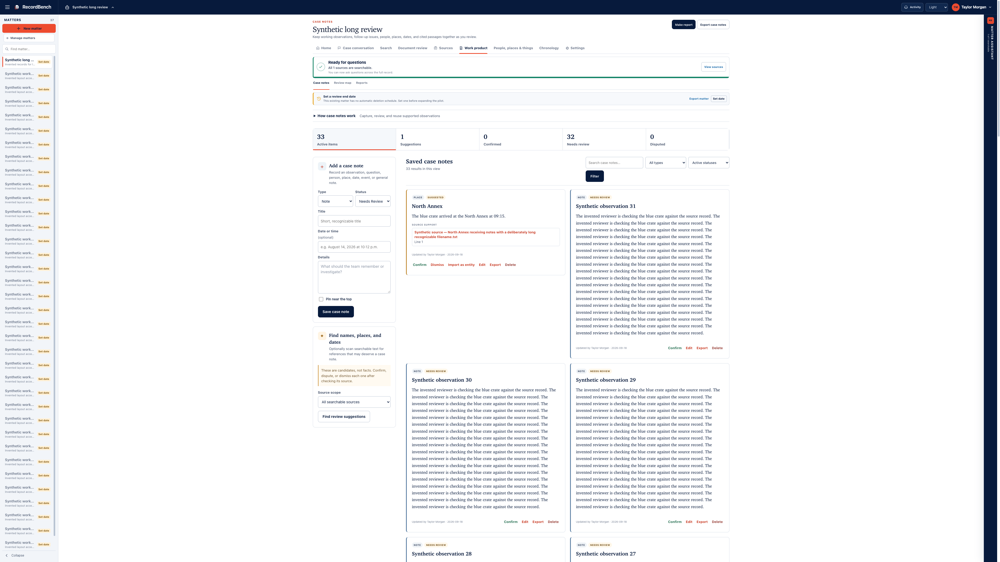

# UI usability cleanup implementation record

Implemented locally on `codex/usability-polish` from source baseline
`a49133f1fe022fb098f2519aea007fa562570371`. The candidate is prepared for source review; this record does not claim
merge, deployment, or installed-node adoption. All browser fixtures use temporary synthetic
records, loopback, test authentication and unavailable generation. No installed
runtime, deployment credentials, model or real matter material was used.

## Resulting experience

- **Navigation follows available workspace width.** Generous layouts retain
  direct section links. When panels or enlarged text leave less room, a native
  section chooser names the current destination and describes all nine choices.
  Existing routes, query parameters, anchors and current-page semantics remain.
- **Case notes remain usable with both panels open.** Tools stack above saved
  notes when the actual content area becomes narrow, keeping complete forms and
  the suggestion action in ordinary scrolling flow. Help is an optional
  disclosure. Larger controls, wrapping filters and statistics, and bounded
  prose improve readability. Wide workspaces gain two columns of notes with
  nearby source support and actions, in normal reading order.
- **Mobile sources are readable cards.** The same source rows expose full
  filenames, selection, collection, review/preparation status and primary
  actions. Associated bulk labels remain visible. Desktop column alignment,
  table semantics, permissions and server-side paging/filtering are retained.
- **Assistant and navigation cooperate.** Compact and desktop display
  preferences are separate. Opening compact navigation or account controls
  collapses the Assistant while retaining its unsent question and conversation.
  Resizing preserves focus on a control that remains visible and uses an enabled
  fallback when the question field cannot take focus.
- **Keyboard and Activity behavior are dependable.** Skip navigation moves real
  focus to the main content. Both themes have visible focus, with a system-color
  outline in forced-colors mode. Activity has a permanent close control while
  loading, contains focus, makes covered content inert, preserves focused
  actions and scroll during polling, and restores focus when dismissed.
- **The Dusk text ledger is readable.** Its header previously measured 1.03:1.
  Scoped theme tokens now produce a minimum measured text contrast of 13.56:1
  in Dusk and 15.29:1 in Light.

## Browser evidence

[Evidence and hashes](ui-usability-audit/2026-09-18/after/manifest.json) describe
this dirty implementation candidate, not a reviewed release commit.
Chrome for Testing and ChromeDriver were version `153.0.8010.36`.

| Journey | Result | Evidence |
| --- | --- | --- |
| Workspace layout and keyboard | 18 checks passed | [Receipt](ui-usability-audit/2026-09-18/after/layout-receipt.json) |
| Native browser zoom | 12 checks passed | [Receipt](ui-usability-audit/2026-09-18/after/zoom-receipt.json) |
| Activity lifecycle | 8 checks passed | [Receipt](ui-usability-audit/2026-09-18/after/activity-receipt.json) |
| Existing Sources Dusk journey | 31 checks passed | [Receipt](ui-usability-audit/2026-09-18/after/dusk-receipt.json) |
| Populated text-ledger contrast | Both themes passed | [Measurements](ui-usability-audit/2026-09-18/after/text-ledger-contrast.json) |

The layout journey covers 320/390-pixel phone widths, the 1024-pixel shell with
both panels open, 1440-by-480 short desktop, independent panel scrolling,
761/820/900-pixel support layouts, 3840-by-2160 proportions, 200-percent root
font size, expanded text spacing, both themes and forced-colors focus. It also
submits suggestions, opens original support, visits every navigation destination,
opens a source, and checks Assistant drafts/preferences/focus across resizing.

Native zoom uses fresh disposable Chrome profiles and a fixed 1280-by-1200
outer window. Zoom factors 125/150/200/400 percent produce layout widths
1024/853/640/320 with DPR 1.25/1.5/2/4. Visual viewport scale and CSS zoom remain
1. Each factor submits suggestions, opens original support, traverses all nine
links by keyboard and reads the complete source filename before opening it.
This is browser zoom evidence; it is not an OS display-scaling test.

The pinned runner includes layout, Activity and zoom, rejects missing or
truncated receipts, and retains only bounded allowlisted artifacts. The ledger
contrast measurement is part of the full-text review script, with
`--ledger-contrast-only` for the targeted check. The initial pass did not rerun full-text review, intake or reports. The
September 19 completion validation below includes all three.

## Other validation and limits

- JavaScript syntax, Python compilation, Compose validation and diff whitespace
  checks passed.
- Runner/environment checks passed: 63 tests in the earlier integrated run;
  the final 36 affected cases also passed after adding six explicit layout
  failure-propagation cases and raising its receipt minimum to 18 checks.
- Affected notebook, conflict, guided-usability and source suites: 59 passed.
  Five PDF/media fixture failures reproduced unchanged on the source baseline.
- All 194 transcription cases passed across the ordinary run and the rerun with
  permission to bind the test loopback server.
- `make check` stopped at publication inspection: ten findings exactly match
  the original baseline, with zero new findings. No exception or bypass was
  added. The complete main unit suite was not run after that gate stopped.

The earlier implementation draft incorrectly described browser assertions and
publication findings as execution-window interruptions. This record replaces
those claims with observed outcomes.

## Completion validation — 2026-09-19

The fresh [evidence manifest](ui-usability-audit/2026-09-19/manifest.json)
identifies the tested UI by file hashes and preserves synthetic receipts.

- All six original pinned journeys passed together: intake, Dusk, reports,
  workspace layout, Activity and actual Chrome zoom.
- Added a seventh pinned journey for a disposable authenticated account at
  320×568. Six checks prove secure local login, header fit, persistent appearance,
  reachable sign-out, keyboard logout, and server rejection of the revoked token.
  No installed accounts or credentials are used.
- The full-text review journey passed all 13 checks, including cancellation/
  resume, exact original support, late and failed-unit coverage, JSON/Markdown
  exports, Report copy, both viewport sizes, and Light/Dusk ledger contrast.
- Independent WebKit 26.5 checks passed at 320, 390, 1024 and 1440 pixels:
  navigation destinations and Escape, reachable suggestions, full source
  filenames, and Activity focus containment/restoration. A suggestion was also
  generated and its original support opened successfully.
- The final runner suite passed 75 tests; all 48 other focused cases passed.
  Transcription passed 194 tests. JavaScript syntax, compilation, Compose
  configuration and diff checks passed.
- The complete Mac application run recorded 2,940 passed, 133 failed, 36 errors,
  nine skipped. An unchanged, isolated baseline recorded 2,911 passed with the
  exact same 169 failing/erroring node IDs. These include Linux-only document
  and media tool paths unavailable on this host. Later runner additions passed
  separately; hosted Linux CI remains the full-suite acceptance gate.
- The ten broad publication findings were from unrelated historical branches
  in the shared repository. The isolated outgoing branch's baseline passed tree
  and complete-history inspection. Candidate publication still uses the
  installed pre-push guard, without bypasses or new scanner exceptions.

### Classic-scrollbar follow-up

Hosted Linux acceptance reproduced a conversation-history overlap at 761 pixels.
The previous height calculation used the viewport, including the space taken by
classic scrollbars. A local synthetic reproduction forced classic scrollbars:
its 844-pixel pane had only 829 usable pixels, leaving history at 693 pixels
while the composer began at 690.84 pixels.

History now uses the pane's measured client height. A ResizeObserver watches
both the pane and composer, so scrollbar and container-size changes retain the
spacing. The same reproduction leaves history at 678 pixels, clear of the
composer. All 19 layout checks and 123 focused tests passed. The runner requires
that additional check; missing/truncated results fail closed.

[Follow-up receipt and source hashes](ui-usability-audit/2026-09-19/scrollbar-followup/manifest.json)
identify this correction separately from the earlier evidence snapshots. New
synthetic browser journeys also use the existing hosted Linux launch policy;
Mac browser sandbox settings are retained. Authentication and live-resize
acceptance wait for the actual visible destination/state before interacting.

### Hosted review follow-up

Two synthetic regressions reproduced the hosted review findings before correction:
multiple answer jobs in one conversation shared a refresh key, and the skip-link
target was absent from server-rendered HTML. Activity now keys every row by its
stable matter/job/run identity. All workbench main landmarks render the skip-link
target and `tabindex="-1"` before JavaScript runs.

The Activity journey additionally checks focus on the second of three answer jobs
sharing one destination across an actual poll, and native keyboard skip-link
activation with page JavaScript disabled. Its ten-check receipt is mandatory;
the runner rejects truncated results. The focused regression suite passed 131
cases. Final-head hosted reviews and Linux CI must cover this correction too.

## Remaining acceptance and handoff

Native OS font/display scaling, physical phone touch/on-screen-keyboard behavior,
and a screen-reader pass remain unrun. WebKit viewport testing does not establish
physical-phone or native Safari acceptance. These limits remain explicit; no
full accessibility certification is claimed.

Before merge, require passing current-head Linux CI and hosted code/security
review (or the verified security-quota exception), reconciled findings, and
full-head maintainer acceptance under `PUBLIC_ALPHA.md`. Local validation does
not substitute for these gates. No deployment is part of this change.
