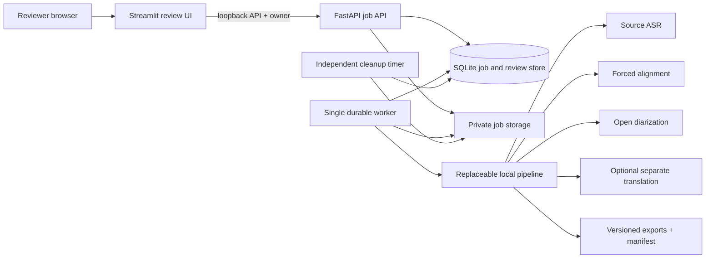

# Transcription service architecture

## Non-negotiable boundaries

- The bundled service owns only its configured environment, database, queue,
  and data directory. It must not read from or modify an unrelated
  transcription installation.
- No public route is assumed. An operator who enables Transcript Studio must
  publish it through the same authenticated gateway used by RecordBench.
- Model execution is local. No hosted transcription, translation, telemetry,
  or model API is part of the runtime path.
- Development defaults to the mock backend. A worker cannot initialize
  WhisperX unless an operator explicitly sets `TRANSCRIPTION_V2_PIPELINE=whisperx`.
- Recordings enter only through an authenticated, deliberate upload. The
  service never imports material from another application or storage tree.

## Components

The UI never imports Torch or model libraries. The API never performs GPU
work. A separate worker atomically claims persisted jobs and checkpoints each
stage. Restarting the browser or API therefore does not lose a job.

## Processing contract

1. Stream the upload to a private job directory while calculating SHA-256.
2. Inspect it with `ffprobe`; retain the original and record only non-content
   media metadata in the manifest.
3. Detect the source language unless a reviewer supplies one.
4. Produce the source-language transcript. The source transcript is never
   replaced by a translation.
5. Force-align source-language text to produce word timestamps.
6. Run diarization with optional speaker bounds. Preserve overlap evidence as
   well as an exclusive assignment used for readable transcript segments.
7. Keep anonymous voice clusters separate from real-world identities. A name
   remains `suggested` until a reviewer confirms it.
8. Produce English translation as a separate field/artifact when requested.
9. Flag low-confidence, overlap, missing alignment, and degraded stages for
   review rather than silently treating them as success.
10. Export the reviewed version together with an immutable machine-output and
    provenance manifest.

## Durable state

SQLite is appropriate for the supported single-host profile when write-ahead logging,
short transactions, and an atomic claim operation are used. The schema keeps:

- immutable job/file IDs and source SHA-256;
- request options and retention deadline;
- job, stage, retry, cancellation, and worker-heartbeat state;
- content-free operational events;
- source/translated transcript segments with revisions;
- speaker cluster mappings and identity status;
- artifact metadata and exact model/pipeline provenance.

This state is operational and temporary, not an archive. The default delivery
grace period is four hours and the configurable hard ceiling is 24 hours. A
download-and-delete response purges the source, transcript rows, speaker
mappings, artifacts, and job metadata immediately after delivery. Expiry does
the same if the user never returns. The UI lists only active deliveries; it has
no historical transcript search.

Uploads also have a separate 48-hour active-job safety cap. This deadline does
not interrupt a running worker, but it removes CREATED/QUEUED uploads that never
start because the worker remains offline. Thus neither the delivery queue nor a
completed result can become indefinite storage.

An independent systemd timer example invokes the same race-safe cleanup path
every five minutes, so expiry does not rely on API traffic or a healthy worker.
It is an inert deployment template and is never enabled by this repository.
Hard deletion uses SQLite secure deletion and checkpoints/truncates the WAL;
failed filesystem cleanup remains retryable on the next timer pass.

The service data root, SQLite database/WAL/SHM, and service-private temporary upload
areas are prohibited backup/snapshot/replication targets. Application cleanup
cannot provide ephemeral semantics once an external system has copied the
bytes.

Recording content and transcript text must not appear in service logs, job
events, exceptions returned to the browser, metrics labels, or process command
lines.

## GPU isolation

The worker takes a cooperative file lock for an entire model run and checks free
VRAM before admission. This coordinates only workers configured to share that
lock. Other GPU processes remain outside the contract, so an operator must
assign an exclusive device or provide a scheduler that coordinates every
consumer. Mock-mode product testing does not require a GPU.

The experimental CPU worker explicitly sets `TRANSCRIPTION_V2_DEVICE=cpu` and
keeps the same offline model approval gate. It uses a cooperative lock under
its data root, serial processing, int8 execution, and batch size 1; the
container must bound its memory. See [CPU execution](CPU_EXECUTION.md).

## Speaker identity trust model

The data model deliberately separates:

- `speaker_key`: anonymous acoustic cluster such as `SPEAKER_01`;
- `display_name`: reviewer-facing name or role;
- `identity_method`: metadata, context, voiceprint, or manual;
- `identity_status`: unknown, suggested, or confirmed;
- `confidence`: calibrated evidence score when available.

The initial release supports roster hints and human confirmation. Any future
voiceprint capability requires a separate authorization decision, matter-scoped
enrollment, encryption, deletion controls, open-set `Unknown`, and calibration
against an authorized, representative evaluation corpus. It must never silently
build a cross-matter voice database.

## Release sequence

1. Run the API, worker, and UI locally in mock mode and test persistence,
   review, export, restart recovery, and deletion.
2. Build an authorized synthetic or consent-cleared gold corpus and score the
   exact candidate pipeline.
3. Stage pinned model weights in the release-controlled cache, then run offline
   quality experiments on an assigned GPU.
4. Select models using cohort-level WER, speaker-attributed WER, DER/JER,
   critical-name/number errors, correction time, failures, and latency.
5. Place Transcript Studio behind the configured authenticated gateway for a
   bounded evaluation group.
6. Expand only after quality, restart, ephemeral-deletion, security, and
   accessibility gates pass.
